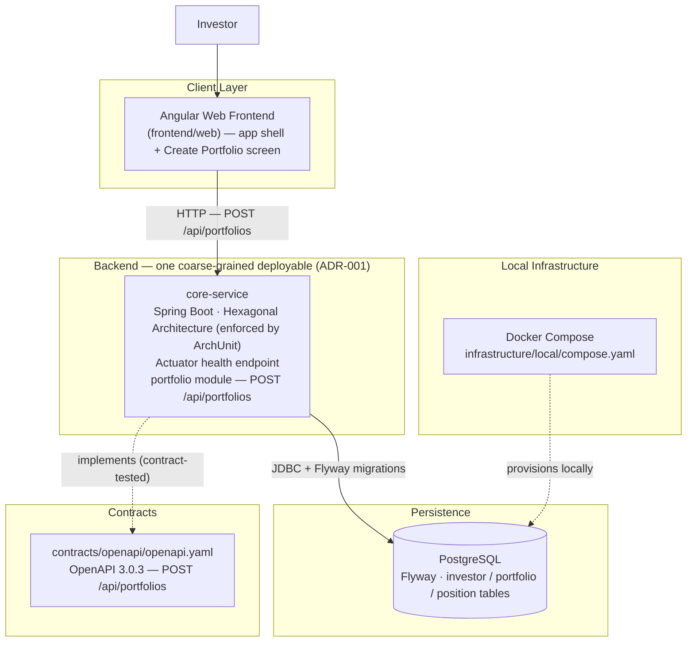
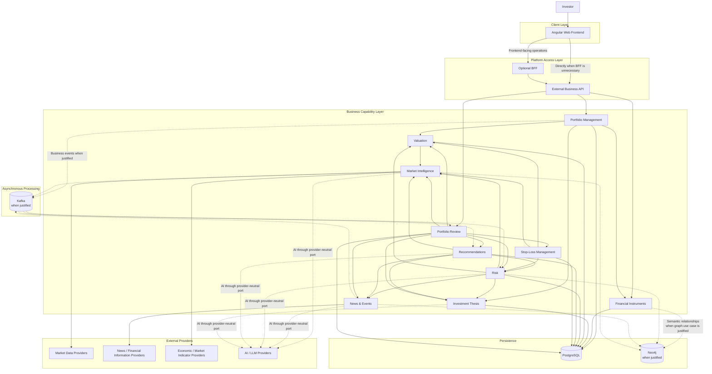

# My-FinAI-Manager — High-Level Container Diagram

## Purpose

This document shows the container/component-boundary architecture of My-FinAI-Manager at two levels:

1. **Current Realized State** — what actually exists in `implementation/platform/` today.
2. **Target Architectural Direction** — the intended logical architecture, not a mandatory deployment topology.

A logical container shown in the target diagram may initially be part of a Modular Monolith and later become independently deployable if justified.

---

## Current Realized State (after FD001)

Established by `EN001 — Bootstrap Executable Platform` under the topology fixed by
`ADR-001 — Initial Backend Topology`, then extended by `FD001 — Create Investment Portfolio` with
the first business capability: a `portfolio` module in `core-service`, the `POST /api/portfolios`
operation, and the `investor` / `portfolio` / `position` schema.

### Not yet realized

The following appear only in the **Target Architectural Direction** below and are intentionally
absent from the current platform:

- BFF, and a separately deployed External Business API container (the API surface exists only as
  the OpenAPI contract location; `core-service` exposes operations directly).
- Business capability modules other than the first slice of Portfolio Management: Financial
  Instruments, Valuation, Risk, Investment Thesis, Market Intelligence, News & Events,
  Recommendations, Stop-Loss, Portfolio Review. (Portfolio Management currently covers only
  portfolio creation — listing, viewing, editing, valuation and risk are not yet realized.)
- Neo4j, Kafka, external market-data / news / indicator providers, AI / LLM providers.
- Authentication / authorization, CI/CD, container images, cloud infrastructure. FD001 writes are
  unauthenticated on purpose — see `ADR-002 — Interim Unauthenticated Write Access`.

---

## Target Architectural Direction

The target diagram shows functional capabilities and optional infrastructure as separate logical
containers for clarity. Per ADR-001, several of these currently coexist (or will be added) as
**internal modules inside the single `core-service` deployable**, not as separate services.
Independent deployment of a capability requires a concrete quality-attribute justification and,
normally, a new ADR.

## Architectural Interpretation

### Frontend

- Angular is the preferred web frontend.
- The frontend is decoupled from backend implementation details.
- It consumes explicit business contracts.

### BFF

- The BFF is optional.
- It is introduced only when frontend-specific aggregation or orchestration justifies it.
- It must not own core business logic.

### External Business API

- It is the primary platform entry point.
- It hides internal topology from external clients.
- REST + OpenAPI is the preferred default.

### Business Capabilities

The target diagram shows functional capabilities, not mandatory microservices.

They are implemented as modules within the single `core-service` deployable (ADR-001, realized by
EN001). `FD001 — Create Investment Portfolio` adds the first modules (Portfolio Management,
Financial Instruments) as siblings of the `platform` package convention established by EN001.

Independent deployment is introduced only when justified by:

- scaling;
- maintenance;
- operational isolation;
- availability;
- runtime differences;
- release cadence;
- security boundaries.

### Persistence

- PostgreSQL is the preferred default relational persistence technology.
- Neo4j is optional and only introduced for graph-oriented capabilities that provide concrete value.

### Asynchronous Processing

- Kafka is optional and introduced only when asynchronous decoupling, buffering, event distribution, or independent scaling provides concrete value.
- The existence of a business event does not automatically imply Kafka.

### External AI

AI and LLM providers are accessed through provider-neutral ports and adapters.

The business core must not depend directly on provider-specific SDKs or data structures.

---

## Evolution

The **Current Realized State** section must always represent what actually exists in
`implementation/platform/`. The **Target Architectural Direction** section represents intended
direction and may show components that do not yet exist.

| Milestone | Effect on this document |
|---|---|
| `EN001` (realized) | Established the current state: Angular shell, single `core-service`, PostgreSQL via Docker Compose, empty OpenAPI skeleton, Actuator health. |
| `FD001` (next) | Adds Portfolio Management + Financial Instruments modules inside `core-service`, the first business schema (Flyway `V2__…`), and the first OpenAPI operation(s). Move those elements from "Not yet realized" into the current-state diagram. |

When a significant architectural decision changes the topology:

1. create or update the corresponding ADR;
2. update `architecture.md` when necessary;
3. update this diagram (both sections as applicable);
4. move components between "Not yet realized" and the current-state diagram as they are built;
5. keep speculative future components in the target section only.
