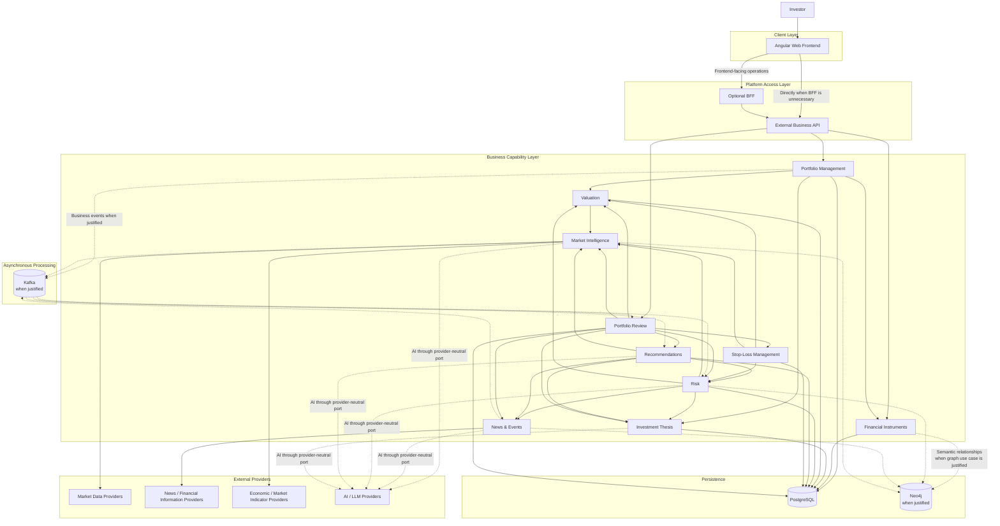

# My-FinAI-Manager — High-Level Container Diagram

## Purpose

This diagram shows the initial logical architecture of My-FinAI-Manager at container/component-boundary level.

It represents the intended architectural direction, not a mandatory deployment topology.

A logical container shown here may initially be part of a Modular Monolith and later become independently deployable if justified.

## Architectural Interpretation

### Frontend

- Angular is the preferred web frontend.
- The frontend is decoupled from backend implementation details.
- It consumes explicit business contracts.

### BFF

- The BFF is optional.
- It is introduced only when frontend-specific aggregation or orchestration justifies it.
- It must not own core business logic.

### External Business API

- It is the primary platform entry point.
- It hides internal topology from external clients.
- REST + OpenAPI is the preferred default.

### Business Capabilities

The diagram shows functional capabilities, not mandatory microservices.

They may initially be implemented as modules within a Modular Monolith.

Independent deployment is introduced only when justified by:

- scaling;
- maintenance;
- operational isolation;
- availability;
- runtime differences;
- release cadence;
- security boundaries.

### Persistence

- PostgreSQL is the preferred default relational persistence technology.
- Neo4j is optional and only introduced for graph-oriented capabilities that provide concrete value.

### Asynchronous Processing

- Kafka is optional and introduced only when asynchronous decoupling, buffering, event distribution, or independent scaling provides concrete value.
- The existence of a business event does not automatically imply Kafka.

### External AI

AI and LLM providers are accessed through provider-neutral ports and adapters.

The business core must not depend directly on provider-specific SDKs or data structures.

---

## Evolution

This diagram must represent the currently approved architecture.

When a significant architectural decision changes the topology:

1. create or update the corresponding ADR;
2. update `architecture.md` when necessary;
3. update this diagram;
4. keep speculative future components out of the current-state view.
