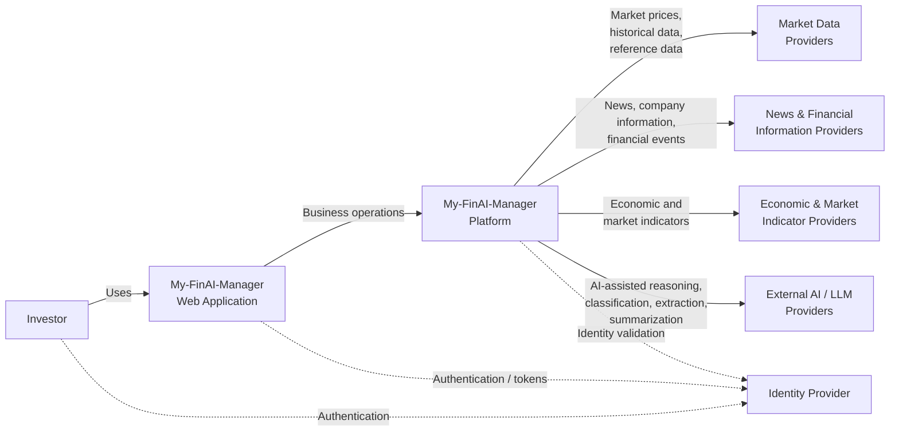

# My-FinAI-Manager — System Context Diagram

## Purpose

This diagram shows My-FinAI-Manager in its external business context.

It identifies the main user and the external systems or information providers with which the platform may interact.

This is a logical product-level view. It does not imply a particular deployment topology.

## Notes

- The Investor is the primary actor.
- External providers are represented as logical capabilities rather than named vendors.
- Concrete providers may change over time.
- AI / LLM access must remain provider-neutral from the perspective of core business capabilities.
- My-FinAI-Manager does not execute investment transactions in Version 1.0.0.
