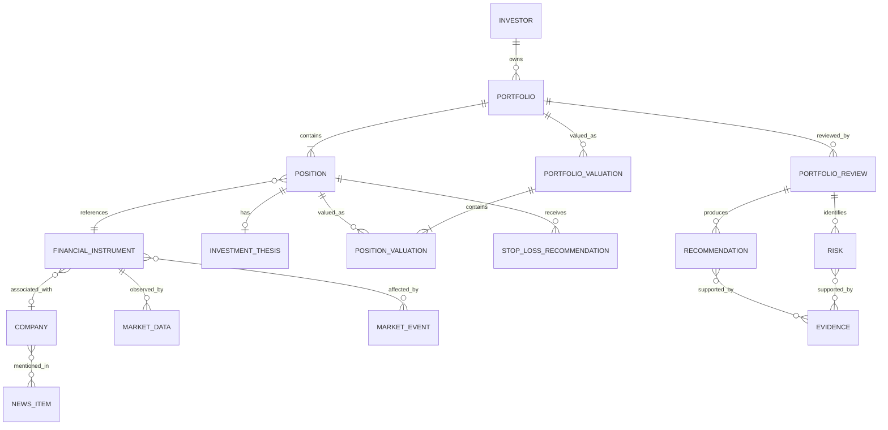

# My-FinAI-Manager — Business Information Model

## Purpose

This document defines the main business information objects managed by My-FinAI-Manager, their key attributes, and their relationships.

It describes the information model from a product and domain perspective.

It does not define:

- database tables;
- API schemas;
- persistence models;
- programming-language classes;
- ORM mappings;
- event schemas;
- or physical storage decisions.

Those concerns belong to architecture and feature implementation.

---

# Information Model Overview

```text
Investor
   │
   └── owns ───────────────► Portfolio
                               │
                               ├── contains ─────► Position
                               │                    │
                               │                    ├── references ─► Financial Instrument
                               │                    │                   │
                               │                    │                   └── associated with ─► Company
                               │                    │
                               │                    └── may have ─────► Investment Thesis
                               │
                               ├── has ───────────► Portfolio Review
                               │                    │
                               │                    ├── includes ─────► Risk
                               │                    ├── includes ─────► Recommendation
                               │                    └── includes ─────► Stop-Loss Recommendation
                               │
                               └── valued through ► Portfolio Valuation

Financial Instrument
   ├── observed through ─────► Market Data
   ├── affected by ──────────► Market Event
   └── related to ───────────► News Item

Risk
   └── supported by ─────────► Evidence

Recommendation
   └── supported by ─────────► Evidence
```

---

# Investor

## Description

Represents the person who owns and manages one or more Portfolios.

## Main Attributes

- Investor ID
- Display Name
- Preferred Currency
- Locale
- Time Zone

## Relationships

- Owns one or more Portfolios
- Receives Alerts
- Receives Recommendations

---

# Portfolio

## Description

Represents a collection of investment Positions managed together by the Investor.

## Main Attributes

- Portfolio ID
- Name
- Description
- Created At
- Updated At
- Status

## Relationships

- Belongs to one Investor
- Contains one or more Positions
- Has Portfolio Reviews
- Has Portfolio Valuations
- May have associated Risks
- May have Recommendations

---

# Position

## Description

Represents the Investor's current holding of a Financial Instrument within a Portfolio.

## Main Attributes

- Position ID
- Quantity
- Average Acquisition Price
- Acquisition Currency
- Opened At
- Last Updated At

## Relationships

- Belongs to one Portfolio
- References one Financial Instrument
- May have one Investment Thesis
- May have Position Valuations
- May have Risks
- May have Recommendations
- May have Stop-Loss Recommendations

---

# Financial Instrument

## Description

Represents an investable financial asset.

## Main Attributes

- Financial Instrument ID
- Instrument Type
- Ticker
- Exchange / MIC
- ISIN
- Display Name
- Trading Currency
- Status

## Relationships

- May be held by many Positions
- May be associated with one Company
- Has Market Data
- May be affected by Market Events
- May be referenced by News Items
- May have Risk information

---

# Company

## Description

Represents the legal or business entity associated with a Financial Instrument.

## Main Attributes

- Company ID
- Legal Name
- Display Name
- LEI
- Country
- Sector
- Industry

## Relationships

- May be associated with one or more Financial Instruments
- May be mentioned in News Items
- May be affected by Market Events
- May be associated with Risks
- May have competitors or business dependencies

---

# Investment Thesis

## Description

Represents the Investor's reasoning for holding or considering a Position.

## Main Attributes

- Investment Thesis ID
- Thesis Text
- Created At
- Updated At
- Status

## Relationships

- Belongs to one Position
- May be evaluated during Portfolio Reviews
- May be supported or challenged by Evidence
- May be affected by Market Events or News Items

---

# Market Data

## Description

Represents observed quantitative market information.

## Main Attributes

- Instrument
- Observation Time
- Market Price
- Currency
- Trading Volume
- Source

## Relationships

- Belongs to one Financial Instrument
- Used by Valuation
- Used by Risk Analysis
- Used by Stop-Loss Assessment

---

# Market Event

## Description

Represents an event that may materially affect one or more Companies, Financial Instruments, sectors, markets, or Portfolios.

## Main Attributes

- Market Event ID
- Event Type
- Title
- Description
- Event Time
- Source
- Confidence / Verification Status

## Relationships

- May affect Companies
- May affect Financial Instruments
- May affect Portfolios
- May contribute Evidence
- May trigger a Portfolio Review

---

# News Item

## Description

Represents published information that may be relevant to the Investor's Portfolio.

## Main Attributes

- News Item ID
- Title
- Summary
- Publication Time
- Publisher
- Source Reference
- Language

## Relationships

- May mention Companies
- May mention Financial Instruments
- May describe Market Events
- May provide Evidence
- May trigger relevance analysis

---

# Risk

## Description

Represents an identified potential adverse exposure.

## Main Attributes

- Risk ID
- Risk Type
- Description
- Severity
- Confidence
- Identified At
- Status

## Relationships

A Risk may relate to:

- Portfolio
- Position
- Financial Instrument
- Company
- Investment Thesis

A Risk may be supported by one or more Evidence items.

---

# Evidence

## Description

Represents information supporting or contradicting an analysis, Risk, Recommendation, or Interpretation.

## Main Attributes

- Evidence ID
- Evidence Type
- Description
- Source
- Observation Time
- Confidence
- Provenance

## Relationships

Evidence may originate from:

- Market Data
- News Item
- Market Event
- Financial information
- Deterministic Calculation

Evidence may support:

- Risk
- Recommendation
- Investment Thesis Assessment
- Portfolio Assessment

---

# Portfolio Valuation

## Description

Represents the calculated value of a Portfolio at a specific point in time.

## Main Attributes

- Valuation ID
- Valuation Time
- Total Value
- Currency

## Relationships

- Belongs to one Portfolio
- Contains Position Valuations

---

# Position Valuation

## Description

Represents the calculated value of a Position at a specific point in time.

## Main Attributes

- Position Valuation ID
- Valuation Time
- Market Price
- Position Value
- Currency
- Position Weight

## Relationships

- Belongs to one Position
- Belongs to one Portfolio Valuation

---

# Recommendation

## Description

Represents an advisory conclusion produced by My-FinAI-Manager.

## Main Attributes

- Recommendation ID
- Recommendation Type
- Description
- Generated At
- Confidence
- Status

## Typical Recommendation Types

- Maintain
- Increase
- Reduce
- Exit
- Add
- Rebalance

## Relationships

A Recommendation may target:

- Portfolio
- Position
- Financial Instrument

It may:

- Be supported by Evidence
- Reference Risks
- Be produced during a Portfolio Review

---

# Stop-Loss Recommendation

## Description

Represents a proposed protective Stop-Loss level for a Position.

## Main Attributes

- Stop-Loss Recommendation ID
- Suggested Price
- Suggested Percentage
- Reference Price
- Currency
- Generated At
- Rationale
- Status

## Relationships

- Belongs to one Position
- May reference Risks
- May be supported by Evidence
- May be generated or updated during a Portfolio Review

---

# Portfolio Review

## Description

Represents a complete assessment of a Portfolio at a particular point in time.

## Main Attributes

- Portfolio Review ID
- Review Type
- Review Time
- Overall Assessment
- Summary

## Review Types

- Initial
- Periodic
- Event-Driven
- Portfolio-Update-Driven

## Relationships

- Belongs to one Portfolio
- Uses a Portfolio Valuation
- Includes Risks
- Includes Recommendations
- Includes Stop-Loss Recommendations
- Uses Evidence
- May compare itself with a previous Portfolio Review

---

# Alert

## Description

Represents information that My-FinAI-Manager considers sufficiently important to bring to the Investor's attention.

## Main Attributes

- Alert ID
- Alert Type
- Message
- Severity
- Generated At
- Status

## Relationships

An Alert may refer to:

- Portfolio
- Position
- Financial Instrument
- Market Event
- Risk
- Recommendation

---

# Main Relationship Rules

At business-model level:

1. An Investor may own multiple Portfolios.
2. A Portfolio belongs to one Investor.
3. A Portfolio contains one or more Positions.
4. A Position belongs to one Portfolio.
5. A Position references one Financial Instrument.
6. A Financial Instrument may appear in Positions belonging to different Portfolios.
7. A Financial Instrument may be associated with a Company.
8. A Position may have an Investment Thesis.
9. Portfolio and Position Valuations are time-dependent.
10. Risks may affect several types of business objects.
11. Recommendations may target a Portfolio, Position, or Financial Instrument.
12. Evidence may support multiple analyses or conclusions.
13. A Portfolio Review aggregates the state and analysis of a Portfolio at a particular point in time.
14. News Items and Market Events may be relevant even when they do not directly mention a Portfolio Position.
15. Historical objects must preserve the time at which their information or conclusion was valid.

---

# Entity Relationship Diagram



---

# Model Evolution

This information model represents the current high-level understanding of the product.

Feature Definitions may:

- add attributes;
- introduce new information objects;
- create new relationships;
- refine cardinalities;
- introduce additional constraints.

A Feature Definition should not silently redefine an existing business concept.

Significant changes to the shared information model should be reflected in this document.
